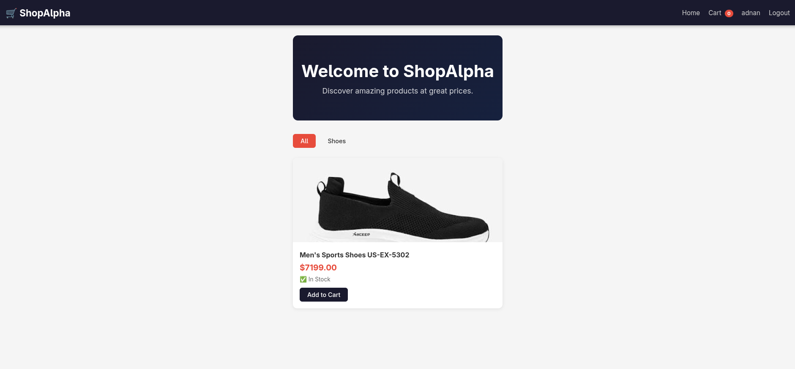

# 🛒 ShopAlpha E-Commerce Store

> Full-stack e-commerce web application built with Django & PostgreSQL



> 📹 A full demo walkthrough is available as `demo.mp4` in the root of this repository.

---

## 📌 Table of Contents

- [Overview](#overview)
- [Features](#features)
- [Tech Stack](#tech-stack)
- [Project Structure](#project-structure)
- [Getting Started](#getting-started)
- [Environment Variables](#environment-variables)
- [Database Setup](#database-setup)
- [Running the Project](#running-the-project)
- [Admin Panel](#admin-panel)
- [Usage Guide](#usage-guide)
- [Screenshots](#screenshots)
- [What I Learned](#what-i-learned)
- [License](#license)

---

## Overview

ShopAlpha is a fully functional e-commerce store built as **Task 1** of the CodeAlpha Full Stack Development Internship. It covers the complete shopping flow — from browsing products by category, adding items to a session-based cart, registering/logging in, and placing an order that persists to a PostgreSQL database.

The project was built from scratch without any frontend framework — just Django templates, plain CSS, and vanilla JavaScript — to solidify understanding of how full-stack web applications work at their core.

---

## Features

### 🛍 Store
- Product listing with responsive CSS Grid layout
- Category filtering via URL query parameters
- Product detail page with stock status
- Session-based shopping cart (works without login)
- Add to cart, update quantity, remove items
- Cart item count badge in navbar (context processor)

### 👤 Authentication
- User registration with email, first name, last name
- Automatic login after registration
- Login / logout
- User profile page with address and phone fields
- `@login_required` protection on checkout

### 📦 Orders
- Full checkout flow with shipping address
- Order creation with per-item price snapshot
- Stock decrement on successful order
- Order success page with order ID and details
- Order management via Django admin

### ⚙️ Admin
- Category and Product management
- Auto-slug generation from product name
- Inline order item editing
- Bulk stock and availability editing

---

## Tech Stack

| Layer | Technology |
|-------|-----------|
| Language | Python 3.14 |
| Framework | Django 6.0 |
| Database | PostgreSQL |
| ORM | Django ORM |
| Frontend | HTML5, CSS3 (Grid/Flexbox), Vanilla JS |
| Templating | Django Template Language |
| Auth | Django built-in auth system |
| Image handling | Pillow |
| Environment | python-dotenv |
| DB Driver | psycopg2-binary |

---

## Project Structure

```
CodeAlpha_EcommerceStore/
│
├── manage.py
├── requirements.txt
├── .env                        # secrets — not committed to git
├── .gitignore
├── preview.png                 # store screenshot for README
├── demo.mp4                    # full walkthrough video
│
├── ecommerce/                  # Django project config
│   ├── settings.py
│   ├── urls.py
│   ├── wsgi.py
│   └── asgi.py
│
├── users/                      # User auth app
│   ├── models.py               # Profile model (extends User)
│   ├── forms.py                # RegisterForm, ProfileUpdateForm
│   ├── views.py                # register, login, logout, profile
│   ├── urls.py
│   └── admin.py
│
├── store/                      # Products, cart, orders app
│   ├── models.py               # Category, Product, Order, OrderItem
│   ├── views.py                # home, product_detail, cart, checkout
│   ├── urls.py
│   ├── admin.py
│   └── context_processors.py  # cart_count injected into every template
│
├── templates/
│   ├── base.html               # parent layout
│   ├── navbar.html             # navigation partial
│   ├── users/
│   │   ├── login.html
│   │   ├── register.html
│   │   └── profile.html
│   └── store/
│       ├── home.html
│       ├── product_detail.html
│       ├── cart.html
│       ├── checkout.html
│       └── order_success.html
│
├── static/
│   ├── css/
│   │   └── style.css
│   └── js/
│       └── cart.js
│
└── media/                      # uploaded product images (auto-created)
    └── products/
```

---

## Getting Started

### Prerequisites

Make sure you have these installed on your machine:

- Python 3.10+
- PostgreSQL
- pip
- git

### 1. Clone the repository

```bash
git clone https://github.com/yourusername/CodeAlpha_EcommerceStore.git
cd CodeAlpha_EcommerceStore
```

### 2. Create and activate a virtual environment

```bash
python -m venv venv
source venv/bin/activate        # Linux / macOS
venv\Scripts\activate           # Windows
```

### 3. Install dependencies

```bash
pip install -r requirements.txt
```

---

## Environment Variables

Create a `.env` file in the project root:

```env
SECRET_KEY=your-long-random-secret-key-here
DEBUG=True
DB_NAME=ecommerce_db
DB_USER=postgres
DB_PASSWORD=yourpassword
DB_HOST=localhost
DB_PORT=5432
```

> ⚠️ Never commit `.env` to git. It is already listed in `.gitignore`.

To generate a secure `SECRET_KEY`:

```bash
python -c "from django.core.management.utils import get_random_secret_key; print(get_random_secret_key())"
```

---

## Database Setup

### 1. Create the PostgreSQL database

Open a terminal and connect to psql:

```bash
psql -U postgres
```

Then run:

```sql
CREATE DATABASE ecommerce_db;
\q
```

> Django does **not** create the database for you — only the tables inside it. You must create the database manually first.

### 2. Apply migrations

```bash
python manage.py makemigrations
python manage.py migrate
```

This creates all required tables in PostgreSQL — including Django's built-in auth, sessions, and your custom models.

### 3. Create a superuser

```bash
python manage.py createsuperuser
```

You'll be prompted for a username, email, and password. This account is used to access the admin panel.

---

## Running the Project

```bash
python manage.py runserver
```

Visit `http://127.0.0.1:8000` in your browser.

| URL | Page |
|-----|------|
| `/` | Home — product listing |
| `/product/<slug>/` | Product detail page |
| `/cart/` | Shopping cart |
| `/checkout/` | Checkout (login required) |
| `/users/register/` | Register |
| `/users/login/` | Login |
| `/users/profile/` | User profile |
| `/admin/` | Django admin panel |

---

## Admin Panel

Visit `http://127.0.0.1:8000/admin` and log in with your superuser credentials.

### Adding products

1. Go to **Categories** → **Add Category**
   - Enter a name (e.g. `Electronics`)
   - The slug auto-fills — leave it as is
   - Save

2. Go to **Products** → **Add Product**
   - Fill in name, description, price, stock
   - Select a category
   - Upload a product image
   - Set **Is available** to checked
   - Save

Products appear on the home page immediately after saving.

### Managing orders

Go to **Orders** to see all placed orders. You can:
- Change order status (Pending → Processing → Shipped → Delivered)
- View all items within each order inline
- Filter orders by status or user

---

## Usage Guide

### As a visitor
1. Browse products on the home page
2. Filter by category using the buttons below the hero
3. Click a product to see its detail page
4. Click **Add to Cart** — the cart badge in the navbar updates
5. Visit the cart to review items, update quantities, or remove items

### As a registered user
1. Register at `/users/register/`
2. You are logged in automatically
3. Add items to cart and proceed to checkout
4. Enter a shipping address and place your order
5. See the order confirmation page with your order ID
6. Update your profile at `/users/profile/`

---

## What I Learned

Building this project from scratch taught me:

**Django fundamentals**
- The MVT (Model–View–Template) request lifecycle
- URL routing with `path()`, `include()`, and named URLs
- Template inheritance with `` and ``
- Context processors for injecting global template data
- Static files vs media files and how Django serves each

**Database and ORM**
- Designing relational models with `ForeignKey` and `OneToOneField`
- Running and understanding Django migrations
- QuerySet methods: `filter()`, `get()`, `get_or_create()`, `order_by()`
- Why price snapshots in `OrderItem` matter for order history integrity

**Authentication**
- Django's built-in `User` model and session-based auth
- Extending `User` with a `Profile` model via `OneToOneField`
- Using `UserCreationForm` and `AuthenticationForm`
- Protecting views with `@login_required` and handling `?next=` redirects

**Session-based cart**
- Storing cart state in `request.session` without a database table
- Why session dict keys must be strings (JSON serialization)
- The importance of reassigning `request.session['cart']` to trigger a save

**Frontend**
- Responsive product grid with CSS Grid `auto-fill` + `minmax()`
- Django's messages framework for flash notifications
- Rendering forms manually with field loops for full styling control
- CSRF protection on every POST form

---

## License

This project was built for the **CodeAlpha Full Stack Development Internship**.
Feel free to use it as a learning reference.

---

*Built by Adnan — CodeAlpha Internship 2026*
